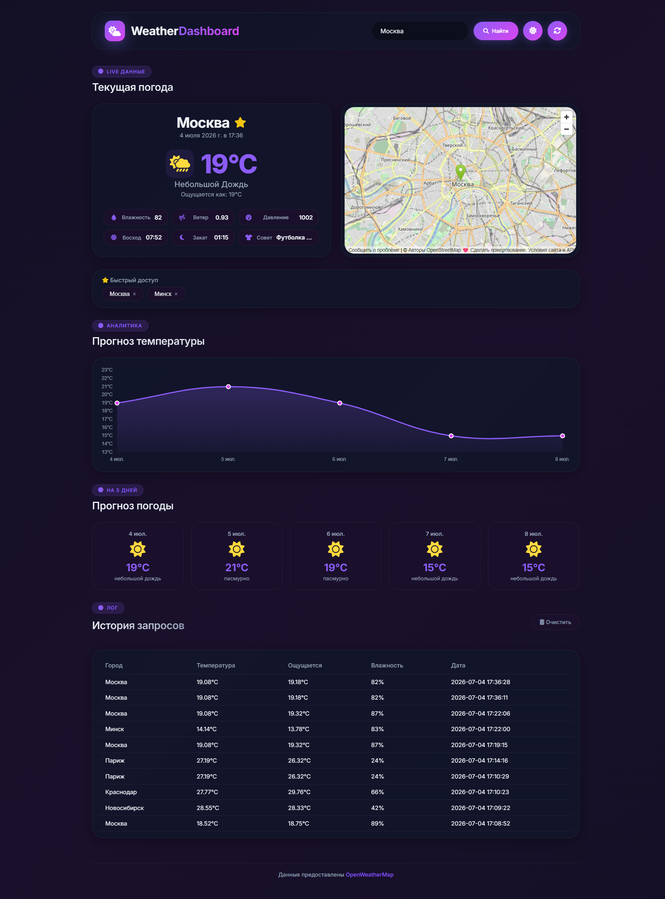
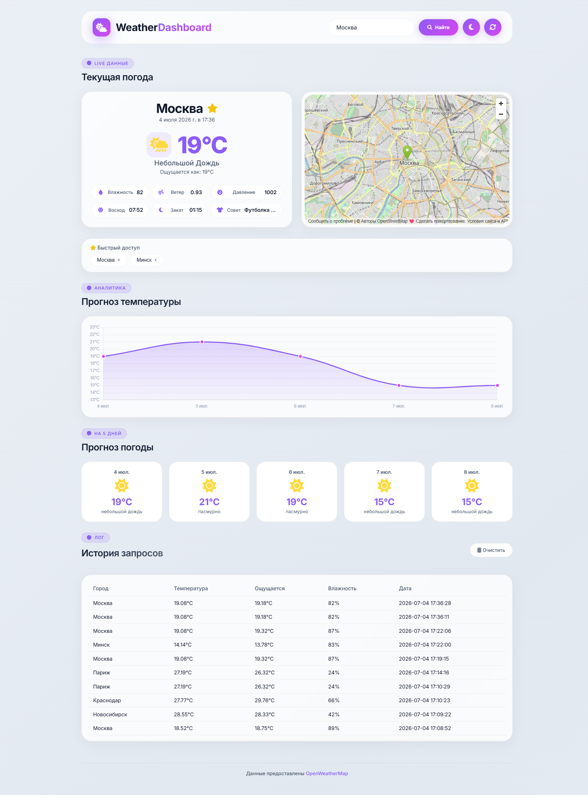

# 🌤️ Weather Dashboard

> Адаптивный дашборд погоды с поддержкой светлой/темной темы, интерактивными графиками и интеграцией с OpenWeatherMap API.

---

## 📸 Скриншоты

| Темная тема | Светлая тема |
|-------------|--------------|
|  |  |

*(На скриншотах выше виден основной функционал: поиск, карта, график и переключение тем).*

---

## 🎬 Демонстрация работы


---

## 🎯 Цели и задачи проекта

Репозиторий создан как практический пет-проект. В процессе разработки были поставлены и решены следующие задачи:
- Интеграция со сторонним REST API (OpenWeatherMap) для получения актуальных данных.
- Реализация адаптивного UI с переключением тем (CSS Variables + JavaScript).
- Изучение архитектуры веб-приложений на Flask (маршрутизация, шаблонизация, работа с формами).
- Обеспечение безопасности приложения через использование `.env` файлов.
- Проработка пользовательского опыта (UX): сохранение истории, избранное, отзывчивый дизайн.

Проект может служить базовым шаблоном для создания современных дашбордов на Python.

---

## 📌 О проекте

Это интерактивный дашборд, который позволяет отслеживать актуальную погоду в любом городе мира, просматривать прогноз на 5 дней и анализировать изменения температуры через визуальный график.

В основе лежит **Flask** с интеграцией **OpenWeatherMap API**. Интерфейс выполнен в современном стиле **Glassmorphism** и адаптирован для просмотра как на ПК, так и на мобильных устройствах.

---

## ✨ Основные возможности

- 🌍 **Поиск погоды** по любому городу мира.
- 🌡️ **Детальная информация:** температура, ощущается как, влажность, ветер, давление, восход и закат.
- 📈 **Визуальный график:** Интерактивный график температуры на 5 дней (библиотека Chart.js).
- 🗺️ **Встроенная карта:** Отображение местоположения города через OpenStreetMap.
- 🌗 **Светлая / Темная тема:** Переключение темы одним кликом с сохранением выбора в браузере.
- ⭐ **Избранное:** Добавление городов в избранное для быстрого доступа.
- 📜 **История запросов:** Автоматическое сохранение истории поиска с возможностью очистки.
- ⚡ **Устойчивость к сети:** Встроенный механизм повторных попыток подключения к API при нестабильном интернете.

---

## 🛠️ Технологический стек

| Backend | Frontend | API & Библиотеки |
| :---: | :---: | :---: |
| Python 3.10+ | HTML5 | OpenWeatherMap API |
| Flask | CSS3 (CSS Variables, Flex/Grid) | OpenStreetMap |
| Pandas | JavaScript (ES6+) | Chart.js |
| python-dotenv | Glassmorphism UI | FontAwesome |
| | AOS (Анимация при скролле) | |

---

## 📬 Контакты

Если у вас есть вопросы, предложения по улучшению или идеи для сотрудничества, свяжитесь со мной:
- **Telegram:** [arlitvinenko](https://t.me/arlitvinenko)

---

## 🚀 Как запустить проект локально

### Вариант 1: Быстрый запуск на Windows
1. Скачайте или клонируйте репозиторий.
2. Дважды кликните по файлу **`run.bat`** в корневой папке проекта.
3. Скрипт автоматически создаст виртуальное окружение, установит все зависимости и через несколько секунд откроет дашборд в вашем браузере.

### Вариант 2: Ручной запуск (Универсальный)

1. Клонируйте репозиторий:
   ```bash
   git clone https://github.com/arlitvinenko/Weather-Dashboard.git
   cd Weather-Dashboard
   ```

2. Создайте виртуальное окружение:
   ```bash
   python -m venv venv
   ```

3. Активируйте виртуальное окружение:

   **Для Windows:**
   ```bash
   venv\Scripts\activate
   ```

   **Для macOS / Linux:**
   ```bash
   source venv/bin/activate
   ```

4. Установите все необходимые зависимости:
   ```bash
   pip install -r requirements.txt
   ```

5. Создайте файл `.env` в корневой папке проекта и добавьте в него ваш API-ключ от OpenWeatherMap:
   ```env
   OPENWEATHER_API_KEY=ваш_ключ_сюда
   ```
   *(Если у вас нет ключа, зарегистрируйтесь на [OpenWeatherMap](https://home.openweathermap.org/users/sign_up) и получите бесплатный ключ).*

6. Запустите сервер Flask:
   ```bash
   python app.py
   ```

7. Откройте браузер и перейдите по адресу:
   ```
   http://localhost:5000
   ```

---
